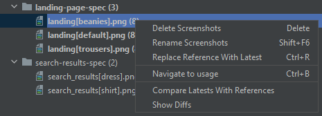

# Terra Support JetBrains plugin
                  
This plugin provides engineers different tools to speed up their work and most importantly, make their work much easier
when working with Cerner's various Terra libraries.

## Table of contents

- [Tools and utilities](#tools-and-utilities)
    - [Code inspections](#code-inspections)
    - [References](#references)
    - [Quick Documentations](#quick-documentations)
    - [Terra wdio tool window](#terra-wdio-tool-window)
- [Plugin contribution guide](#plugin-contribution-guide)

## Tools and utilities

### Code inspections

There are a handful of code inspections available for validating different aspects of Terra wdio tests.

The inspections listed below are enabled by default, unless stated otherwise.

For the high-level types of inspections, see the [Contribution guide](/CONTRIBUTE.md#implementing-inspections).

#### Incorrect viewport value(s) in Terra.describeViewports blocks

This inspection reports problems where one or more viewports defined in one or more `Terra.describeViewports` in a spec file are not one of the breakpoints supported by Terra, namely:
tiny, small, medium, large, huge, enormous.

Be it a completely different viewport name, or just a typo, such values would cause the test/test suite execution not to start.

**Examples for invalid constructs:**

```javascript
Terra.describeViewports('', ['tiny', 'small', 'med', 'huge', 'enorm'], () => {
});

Terra.describeViewports('', ['gigantic'], () => {
});
```

Implementation class: `com.picimako.terra.wdio.viewports.inspection.TerraDescribeViewportsBlockingInspection`

**FUTURE PLANS:**
- Handle viewport values when the array is defined in a separate const.

#### Viewports in Terra.describeViewports should be enumerated in ascending order

This inspection reports problems where the viewports in one or more `Terra.describeViewports` in a spec file are not specified in ascending order
by their widths.

Although the order in what the viewports are specified doesn't affect the test execution negatively,
having them specified this way ensures that test implementations are consistent, it is easily readable what viewports are actually covered.

**Examples:**

```javascript
Terra.describeViewports('', ['large', 'huge', 'medium'], () => {
    //correct: ['medium', 'large', 'huge']
});

Terra.describeViewports('', ['tiny', 'enormous', 'medium', 'large', 'huge', 'small'], () => {
    //correct: ['tiny', 'small', 'medium', 'large', 'huge', 'enormous']
});
```

**FUTURE PLANS:**
- This could also have a quick fix to put them into correct order.

Implementation class: `com.picimako.terra.wdio.viewports.inspection.TerraDescribeViewportsInspection`

#### Duplicate viewport values in Terra.describeViewports blocks

Copy-paste issues and typos can happen, so this inspection checks for duplicate viewport values, but only highlights
the ones that are actually supported by terra. The rest will be signaled by another inspection, that they are not supported.

**Example:**

```javascript
Terra.describeViewports('', ['small', 'small'], () => {
});

Terra.describeViewports('', ['asd', 'enormous', 'asd', 'enormous', 'huge', 'enormous'], () => {
});
```

Having duplicate viewports is not an incorrect construct and in itself it doesn't result in test execution failure,
even more it may be used to run test cases multiple times for the same viewport(s).

So, the first `Terra.describeViewports` block in the example above will actually run the selected test cases for the *small* viewport twice.

Implementation class: `com.picimako.terra.wdio.viewports.inspection.TerraDescribeViewportsInspection`

#### Blank viewports argument array in Terra.describeViewports blocks

This inspection reports problems where either the viewports argument is an empty array, or all items in it are blank
(either empty or contains only white spaces). 

**Example:**

```javascript
Terra.describeViewports('', [], () => {
});

Terra.describeViewports('', [''], () => {
});

Terra.describeViewports('', ['', '  ', ''], () => {
});
```

Implementation class: `com.picimako.terra.wdio.viewports.inspection.TerraDescribeViewportsBlockingInspection`

#### Non-array-type viewports argument value in Terra.describeViewports blocks

The viewports argument of `Terra.describeViewports` accepts an array only, so any other type of value will be reported by this check.

**Example:**

```javascript
Terra.describeViewports('', { }, () => {
});

Terra.describeViewports('', 'tiny', () => {
});

Terra.describeViewports('', false, () => {
});
```

Implementation class: `com.picimako.terra.wdio.viewports.inspection.TerraDescribeViewportsBlockingInspection` 

#### Nested Terra.describeViewports blocks

This inspection is based on the official [Terra Webdriver.io Utility Developer's Guide](https://github.com/cerner/terra-toolkit-boneyard/blob/main/docs/Wdio_Utility.md)
which states that
> Terra.describeViewports blocks should not be nested and if tests need to run against different viewports then they should have their own top level Terra.describeViewports block.

Thus, the nested `Terra.describeViewports` blocks, such as the ones in the example below, should be avoided:

```javascript
Terra.describeViewports('Top level', ['tiny', 'small'], () => {
    Terra.describeViewports('Nested', ['huge', 'large'], () => {
    });

    describe('A describe block', () => {
        Terra.describeViewports('More nested', ['medium', 'enormous'], () => {
        });
        it('an it block', () => {
        });
    });
});

Terra.describeViewports('Top level', ['tiny', 'large'], () => {
    Terra.describeViewports('Nested', ['huge', 'large'], () => {
    });
});
```

Implementation class: `com.picimako.terra.wdio.viewports.inspection.NestedTerraDescribeViewportsBlocksNotAllowedInspection`

#### Terra element validation is preferred over screenshot validation

This inspection reports problems where either a `Terra.validates.screenshot()` or a `Terra.it.matchesScreenshot()` call is used.

It is partially based on the official [Terra Webdriver.io Utility Developer's Guide](https://github.com/cerner/terra-toolkit-boneyard/blob/main/docs/Wdio_Utility.md)
which states that
> It is preferred to use Terra.it.validatesElement(). Terra.should.matchScreenshot() may eventually be deprecated.

and based also on that some projects might want to/have to incorporate accessibility features in their products taking them into account as early as the
UX design phase. This helps to make sure accessibility issues are caught during automated testing.
    
**Example:**

```javascript
Terra.describeViewports('Test', ['large', 'huge'], () => {

    describe('A describe block', () => {
        it('an it block', () => {
            browser.url('/some/url');
            Terra.validates.screenshot(); //correct: Terra.validates.element();
        });
    });

    Terra.it.matchesScreenshot(); //correct: Terra.it.validatesElement();
});
```

**FUTURE PLANS:**
- update this to provide a Quick Fix too

Implementation class: `com.picimako.terra.wdio.screenshot.inspection.TerraElementValidationIsPreferredOverScreenshotInspection`

#### misMatchTolerance value is above a predefined threshold

Although in some circumstances specifying the `misMatchTolerance` property may be necessary, it might be good practice to have a
threshold acting as the maximum value allowed for this property, since, quoting the [Terra Webdriver.io Utility Developer's Guide](https://github.com/cerner/terra-toolkit-boneyard/blob/main/docs/Wdio_Utility.md)

> increasing this value will decrease test coverage.

The default threshold is 0.5, but it can be overridden via the inspection's Settings UI.

**Example (according to the default threshold):**

```javascript
Terra.validates.element({ misMatchTolerance: 0.6 });
Terra.validates.element({ misMatchTolerance: 23 });
Terra.validates.element({ misMatchTolerance: 181 });
```

Implementation class: `com.picimako.terra.wdio.screenshot.inspection.ScreenshotMismatchToleranceInspection`

#### misMatchTolerance has negative value or a value greater than 100

According to the [Terra Webdriver.io Utility Developer's Guide](https://github.com/cerner/terra-toolkit-boneyard/blob/main/docs/Wdio_Utility.md)
the value specified in the `misMatchTolerance` property should be a number **between 0 and 100**, thus this inspection is meant to signal values
that are either negative or greater than 100.

```javascript
Terra.validates.element({ misMatchTolerance: -4 });
Terra.validates.element({ misMatchTolerance: 153 });
```

Implementation class: `com.picimako.terra.wdio.screenshot.inspection.ScreenshotMismatchToleranceBlockingInspection`

#### misMatchTolerance has a non-numeric value defined

According to the [Terra Webdriver.io Utility Developer's Guide](https://github.com/cerner/terra-toolkit-boneyard/blob/main/docs/Wdio_Utility.md)
the value specified in the `misMatchTolerance` property should be a **number** between 0 and 100, thus this inspection is meant to signal values
that are not numeric ones.

**Example:**

```javascript
Terra.validates.element({ misMatchTolerance: "asdsad" });
Terra.validates.element('test case', { selector: '#root', misMatchTolerance: "asdsad" });
Terra.validates.element('test case', { misMatchTolerance: { } });
Terra.validates.element('test case', { misMatchTolerance: false });
```

Implementation class: `com.picimako.terra.wdio.screenshot.inspection.ScreenshotMismatchToleranceBlockingInspection`

### References

#### Screenshots

Invoking one of the "Go to declaration" shortcuts on the first, String parameter of screenshot validation function calls, you can navigate to the
`reference` version of the referenced image, or images when there are multiple ones with the same name but different contexts.

**Example:**

The code snippet below will reference the screenshot(s) named `terra_screenshot[with_extra_-_plus_info-].png`:

```js
describe('outer describe', () => {
    describe('terra screenshot', () => {
        Terra.it.matchesScreenshot('with extra | plus info?', { selector: '#selector' });
    });
});
```

while the snippet below will reference `terra_screenshot-[with_extra_--plus_info].png`:

```js
Terra.describeViewports('viewports', ['medium'], () => {
    describe('terra screenshot?', () => {
        it ('test case', () => {
            Terra.validates.element('with extra <> plus info');
        });
    });
});
```

A set of characters are replaced, so that characters reserved by operating systems will not be used in file names:
- any whitespace and the dot (.) character is replaced with an underscore (_)
- ?, <, >, /, |, *, :, +, " characters are replace with a hyphen (-) 

For the following calls, there will be no reference added, since there is no element (the name parameter) to add the reference to:

```js
Terra.validates.screenshot({ selector: '#root'});
Terra.validates.element({ selector: '#root' });
Terra.it.matchesScreenshot({ selector: '#root' });
Terra.it.validatesElement({ selector: '#root' });
```

### Quick Documentations

[Quick Documentation](https://www.jetbrains.com/help/idea/viewing-reference-information.html?keymap=primary_windows#inline-quick-documentation) is one of the documentation
types of JetBrains products which can be triggered via Ctrl+Q (on Windows) or F1 (on Mac). It shows a popup with some rendered information.

#### Terra viewports

Each viewport String value (only the supported viewports) within `Terra.describeViewports`' function argument lists is extended with Quick Documentation, providing
basic information about the size of the desired viewport.


The information shown is based on the Breakpoints table in the [Terra Breakpoints Guide](https://engineering.cerner.com/terra-ui/components/terra-breakpoints/breakpoints/about#breakpoints). 

Implementation class: `com.picimako.terra.documentation.TerraDescribeViewportsDocumentationProvider`

### Terra WDIO objects and functions

There are a few external documentations on GitHub that are useful for Terra wdio testing, these are
- [Webdriver.io Utility Developer's Guide](https://github.com/cerner/terra-toolkit-boneyard/blob/main/docs/Wdio_Utility.md)
- [Axe Accessibility Rule Descriptions](https://github.com/dequelabs/axe-core/blob/develop/doc/rule-descriptions.md)

and later there may be more.

To make them easily available, they are included in the Quick Documentation popup of each Terra object and function that are related to wdio testing.


When there are multiple documentations e.g. for `validatesElement()` that include both screenshot validation and accessibility testing as well, multiple relevant links are displayed:


Implementation class: `com.picimako.terra.documentation.TerraWdioDocumentationProvider`

### Terra UI Components

In front-end applications, the [Terra UI Components](https://engineering.cerner.com/terra-ui/components) can be utilized as React JS tags (among other things).

Although regular external components have a default Quick Documentation popup with some basic information,
for Terra component tags it is extended with a link (right under the component path) pointing to the official documentation of the particular component, so it can
be opened right from the editor.

The generated documentation URLs are based on the Terra components' names (e.g. `ResponsiveElement`, or in case of subcomponents like `Grid.Row`, it is `Grid`), and the import path from where they are imported.


Certain component names may be found in multiple Terra packages, in that case it is not just the component name that is shown in the link but the family / group name the component is imported from,
so that it can be distinguished from the component with the same name in other packages.


**Connection to other Quick Documentation popups**:

If any of these Quick Documentation tooltips would interfere with, or override an existing functionality that you need in a, previous Quick Documentation popup content, please raise an issue.

Implementation class: `com.picimako.terra.documentation.TerraUIComponentDocumentationUrlProvider`

## Terra wdio tool window

This is a custom tool window which is inspired by the [Terra Wdio Helper VSCode plugin](https://marketplace.visualstudio.com/items?itemName=juzerzarif.terra-wdio-helper),
which is a great plugin, so if you are working with VSCode and Terra testing, make sure you have it installed. It will greatly benefit you.

This tool window collects the wdio spec files and screenshots in the project, and provides a more convenient aggregate view of them,
with additional actions for bulk operations to be applied on those files and folders.

NOTE: currently it doesn't support when multiple projects are opened in the same application window in the same workspace.

### Aggregate view

The tool window provides a tree view of the wdio resources in the project, which maps the original folder structure of Terra wdio files,
like this (having `tests/wdio` as the base folder):

```
- tests
    - wdio
        - __snapshots__
             - diff
                 - <locale>
                     - <browser>_<viewport>
                         - <spec file name>
                             - <screenshot_1>.png
                         - <another spec file name>
                             - <screenshot_3>.png
             - latest
                 - <locale>
                     - <browser>_<viewport>
                         - <spec file name>
                             - <screenshot_1>.png
             - reference
                 - <locale>
                     - <browser>_<viewport>
                         - <spec file name>
                             - <screenshot_1>.png
                             - <screenshot_2>.png
                             - ...
             - reports
                 - <result-report-name>.json
             - <spec-file-name>-spec.js
             - <another-spec-file-name>-spec.js
```

and creates a new structure, so that users can have an overview of what specs and screenshots are available in the project, and can handle multiple specs and screenshots with a single command,
as bulk operations:

```
- Wdio Resources                  <- This is the root node in the tree, which is permanent. It cannot be modified or removed.
     - <spec file name>           <- A spec node referencing all spec folders with the same name.
         - <screenshot_1>.png     <- A screenshot node referencing all screenshot files with the same name.
         - <screenshot_2>.png
     - <another spec file name>
         - <screenshot_3>.png
```

When building this tree view, the logic behind also takes into account when spec JS files are in single or multiple subfolders under the base test path.
They are collected in the same way into this view, their parent folders (as of now) are not displayed in the tool window.


### Wdio test root paths

Since wdio test resources can be placed anywhere in a project, the tool window currently supports the probably most common wdio root paths:
- `/tests/wdio`
- `/test/wdio`

If any of these are found, the tool window will base the resource collection and aggregate view building on that particular test root folder.

The set of wdio test roots are stored at `com.picimako.terra.wdio.TerraWdioFolders#BASE_TEST_ROOTS`.

For now, if a project happen to use a different root than the currently supported ones, there are two ways to support it.
Either rename that folder to one of the pre-defined ones, or add that folder to the set of roots, which also requires a new build and release of this plugin,
but the first is the preferred option.

**FUTURE PLANS:**
- Add support to customize the set of roots on a per application (JetBrains application, not client specific application) basis.

### Criteria for the tool window to be enabled

Since only certain projects require the Terra wdio tool window, specifically the ones that has wdio tests, the tool window has the following criteria,
which when met, the tool window is displayed:
- the project is not a default project
- one of the wdio test root folders is present in the project

### Node types

There are three node types in the tool window
- the **Wdio Resources** root node which is permanent, cannot be moved, removed or modified, it is there, so that the tree view has a root,
and that it provides statistics about the overall project from wdio perspective.
- **Spec node**: for each spec JS file in the project, it displays a folder node for the spec folders with the same name.
Under the hood, it stores the references for each spec folder in the project for the name, from each `__snapshots__/reference` folders. 
- **Screenshot node**: screenshots are displayed within the spec folders. For each screenshot file in the project, it displays a screenshot node.
Under the hood it keeps track of screenshots of the same name from each `__snapshots__/diff`, `__snapshots__/latest` and `__snapshots__/reference` folders,
regardless of what locale and browser_viewport folders they are in.

#### Highlighting nodes

Screenshot nodes are highlighted with bold text when at least one of the underlying image files for a name has a diff image. This makes it easier to see
what images' comparisons failed.

Spec nodes are also highlighted with bold text when at least one of the underlying image nodes has a diff image.


### Statistics

All three node types provide basic statistics about the number of specs and screenshots available in the project.
- **Wdio Resources**: displays statistics about the overall, distinct number of spec JS files and screenshot files in the project.
- **Spec node**: displays how many screenshots can be found under the spec with a distinct name 
- **Screenshot node**: displays the number of screenshot files that are available with this particular node's name

### Actions

Screenshot nodes also provide bulk actions to work with them, in the form of context menu items and keyboard shortcuts.



| Action | Description | Shortcut keys |
|---|---|---|
| Rename Screenshots | Renames all screenshot files under the wdio test root with the same name.<br>When this action is invoked, a message popup appears populated with the file name, for which a simple validation is in place: the new name cannot be blank, and cannot be the same as its original name.<br>If the extension is erased from the new name, it is added back automatically before saving. | **Shift+F6** (the common Rename shortcut) |
|  |  |  |
| Delete Screenshots | Deletes all screenshot files under the wdio test root with the same name.<br>Before deletion, it show a message popup asking for confirmation from the user whether he/she really wants to delete all such files. | **Delete** |
|  |  |  |
| Replace Reference With Latest | Replaces all reference screenshot files with their latest counterparts under the wdio test root with the same name.<br>The action is available only when there is at least one screenshot as the latest version of the reference images. | **Ctrl+R** (**Command+R** on Mac) |
| Show Diffs | Opens the Terra Diff Preview for the selected image name.<br>The action is available only when there is at least one screenshot as the diff version of the reference images.<br><br>See details in the [Diff screenshot previews](#diff-screenshot-previews) section below.|  **Ctrl+D** (**Command+D** on Mac) |
| Compare Latests With References | Opens the Terra Diff Preview for the selected image name.<br>The action is available only when there is at least one screenshot as the latest version of the reference images.<br><br>See details in the [Diff screenshot previews](#diff-screenshot-previews) section below. | **Enter** shortcut key or **mouse double-click** |

## Diff screenshot previews

There are two image previews available for viewing diff screenshots. These are custom editor implementations for displaying one or more screenshots in the same view,
so that investigating a diff screenshot collection for the same file name (but for different contexts) becomes easier.

These previews are displayed as separate editor tabs when an image file is opened, and that particular image file is eligible for showing the preview.

|  | Terra: Diff Preview | Terra: Reference / Latest Preview |
|---|---|---|
| From where can it be opened? | From the **Project view**, or from the **Terra wdio tool window**, selecting the `Show Diffs` context menu option on a screenshot node. | From the **Project view**, or from the **Terra wdio tool window**, selecting the `Compare Latests With References` context menu option on a screenshot node. |
| Which files does it open for? | From the **Project view**, it is displayed when opening any Terra `diff` image. From the **Terra wdio tool window** it can be opened for screenshot nodes but only if there is at least one `diff` screenshot for that file name. | From the **Project view**, it is displayed when opening any Terra `reference` or `latest` image. From the **Terra wdio tool window** it can be opened for screenshot nodes but only if there is at least one `latest` screenshot for that file name. |
| Does it get focus? | When an image is opened via the **Project view**, the default image editor is shown. Using the `Show Diffs` context menu option also focuses the view on the Diff Preview.  | Behaves the same as for the `Diff Preview` but instead it is the `Reference / Latest Preview` that is focused. |
| What is displayed in the preview? | It shows one or more `diff` images for a given screenshot name. | It shows one or more pairs of `reference`/`latest` images, each displayed side-by-side. Each split panel can be resized but their states are not remembered for later openings. |

Both previews also show the screenshot context (locale, browser, viewport) above each image to help identify them.

**Terra: Diff Preview**


**Terra: Reference/Latest Preview**


## Plugin contribution guide

To add features, bugfixes or provide any kind of contribution to this project, please see the [Contribution guide](/CONTRIBUTE.md).

## Images and logos

The Terra Support plugin logo is a custom-drawn logo inspired by the original [Terra logo](https://engineering.cerner.com/terra-ui/home/terra-ui/index),
and it portrays a moon which orbits a planet, which orbits a "cold star".

Images for test data are from [Unsplash.com](https://unsplash.com/) from the following artists:
- [Carter Baran](https://unsplash.com/photos/W7sVwg3EEjA)
- [Emre Gencer](https://unsplash.com/photos/NZMeJsrMC8U)

## Licencing

This project and the [Terra Support plugin logo](src/main/resources/META-INF/pluginIcon.svg) is licensed under the terms of Apache Licence Version 2.0.

If you find anything copyrighted regarding Cerner or Terra material that must not be used in this project, or should be used with certain
restrictions or limitations, please let me know by creating an issue, then we can discuss the issue further in private channels,
after which I will look into it, and alter/modify/remove the material in question if necessary.
