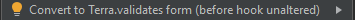
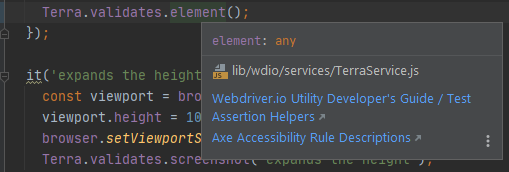
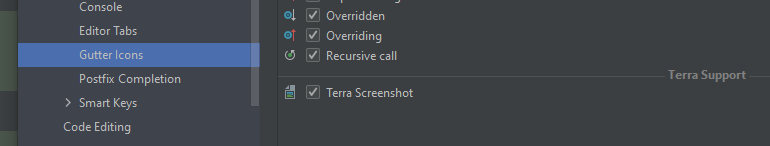
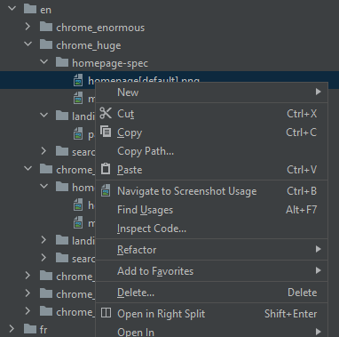
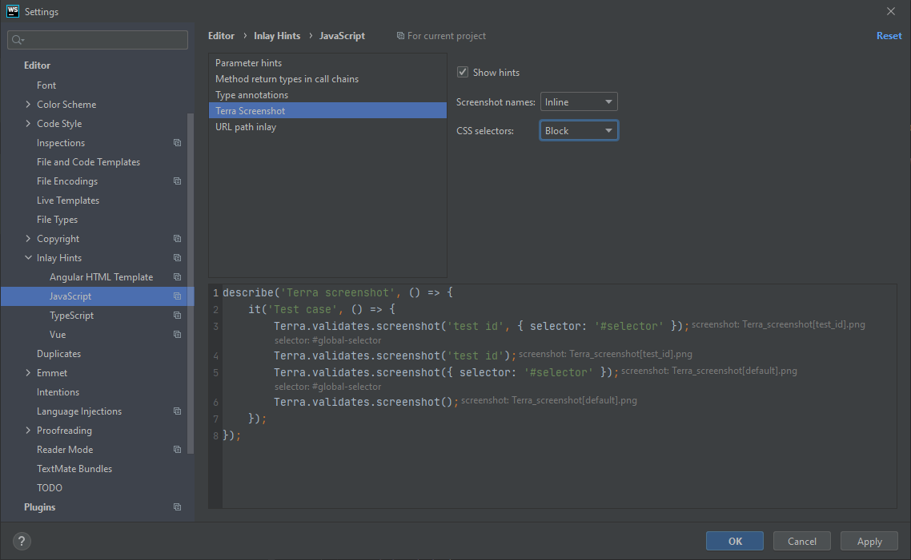

# Terra Helpers

## Inspections

### Terra element validation is preferred over screenshot validation

 [](../src/main/java/com/picimako/terra/wdio/screenshot/inspection/TerraElementValidationIsPreferredOverScreenshotInspection.java)

This inspection reports problems where either a `Terra.validates.screenshot()` or a `Terra.it.matchesScreenshot()` call is used.

This is based on that some projects might want to/have to incorporate accessibility features and validation in their products. This helps to make sure accessibility issues are caught during automated testing.

**Example:**

```javascript
Terra.describeViewports('Test', ['large', 'huge'], () => {
    describe('A describe block', () => {
        it('an it block', () => {
            browser.url('/some/url');
            Terra.validates.screenshot(); //correct: Terra.validates.element();
        });
    });

    Terra.it.matchesScreenshot(); //correct: Terra.it.validatesElement();
});
```

### misMatchTolerance value is above a predefined threshold

 [](../src/main/java/com/picimako/terra/wdio/screenshot/inspection/ScreenshotMismatchToleranceInspection.java)

Although, in some circumstances, specifying the `misMatchTolerance` property may be necessary, it is good practice having a
threshold as the maximum value allowed for this property, since, quoting the [Terra Webdriver.io Utility Developer's Guide](https://github.com/cerner/terra-toolkit-boneyard/blob/main/docs/Wdio_Utility.md)

> increasing this value will decrease test coverage.

The default threshold is 0.5, but it can be overridden via the inspection's Settings UI.

**Examples (according to the default threshold):**

```javascript
Terra.validates.element({ misMatchTolerance: 0.6 });
Terra.validates.element({ misMatchTolerance: 23 });
Terra.validates.element({ misMatchTolerance: 181 });
```

### misMatchTolerance has negative value or a value greater than 100

 [](../src/main/java/com/picimako/terra/wdio/screenshot/inspection/ScreenshotMismatchToleranceInspection.java)

According to the [Terra Webdriver.io Utility Developer's Guide](https://github.com/cerner/terra-toolkit-boneyard/blob/main/docs/Wdio_Utility.md)
the value specified in the `misMatchTolerance` property should be a number **between 0 and 100**, thus this inspection is meant to signal values
that are either negative or greater than 100.

**Examples:**

```javascript
Terra.validates.element({ misMatchTolerance: -4 });
Terra.validates.element({ misMatchTolerance: 153 });
```

### misMatchTolerance has a non-numeric value defined

 [](../src/main/java/com/picimako/terra/wdio/screenshot/inspection/ScreenshotMismatchToleranceBlockingInspection.java)

According to the [Terra Webdriver.io Utility Developer's Guide](https://github.com/cerner/terra-toolkit-boneyard/blob/main/docs/Wdio_Utility.md)
the value specified in the `misMatchTolerance` property should be a **number** between 0 and 100, thus this inspection is meant to signal values
that are not numeric ones.

**Examples:**

```javascript
Terra.validates.element({ misMatchTolerance: "asdsad" });
Terra.validates.element('test case', { selector: '#root', misMatchTolerance: "asdsad" });
Terra.validates.element('test case', { misMatchTolerance: { } });
Terra.validates.element('test case', { misMatchTolerance: false });
```

### Missing screenshots

 [](../src/main/java/com/picimako/terra/wdio/screenshot/inspection/MissingScreenshotInspection.java)

When an image, referenced by `Terra.it` and `Terra.validates` calls, doesn't exist for any context (locale, browser, viewport),
this inspection marks either the name parameter of such calls, or if they are missing (and the default value `default` is used),
then marks the function call's name element.

**Examples:**

In the following snippet the String literal `'screenshot'` will be marked

```js
Terra.describeViewports('viewports', ['medium'], () => {
    describe('terra', () => {
        Terra.it.validatesElement('screenshot', { selector: '#selector' });
    });
});
```

while in the next one, it is the `Terra.it.validatesElement` part that gets marked:

```js
Terra.describeViewports('viewports', ['medium'], () => {
    describe('terra', () => {
        Terra.it.validatesElement({ selector: '#selector' });
    });
});
```

### Screenshot selector matches Terra global selector

 [](../src/main/java/com/picimako/terra/wdio/screenshot/inspection/GlobalTerraSelectorInspection.java)

Terra-toolkit provides various config options for wdio test execution that can be defined in the project's wdio.conf.js.
One of these properties is `terra.selector` in which a global/default CSS selector can be specified for capturing screenshots
when no CSS selector is specified explicitly in a test.

Given the following `wdio.conf.js`:

```js
const wdioConf = require('./config/wdio/wdio.conf');
const config = {
    ...wdioConf.config,
    terra: {
        selector: '#global-selector',
    },
};
exports.config = config;
```

during screenshot capturing the following selectors will be used:

```js
Terra.validates.element('an element', { selector: '#selector' }); // #selector

Terra.validates.element('an element'); // #global-selector
```

### Invalid Terra validation properties

 [](../src/main/java/com/picimako/terra/wdio/screenshot/inspection/InvalidTerraValidationPropertiesInspection.java)

This inspection reports JS properties of `Terra.it` and `Terra.validates` helpers, that are not applicable to the particular helpers.

It handles both terra-toolkit and terra-functional-testing specific properties based on which library is used in the project.

**Valid properties**

| Helpers | terra-toolkit | terra-functional-testing |
|---|---|---|
| `Terra.it.matchesScreenshot`/`validates.screenshot` | `misMatchTolerance`, `selector`, `viewports` | `mismatchTolerance`, `selector` |
| `Terra.it.validatesElement`/`validates.element` | `misMatchTolerance`, `selector`, `axeRules` | `mismatchTolerance`, `selector`, `rules` |
| `Terra.it.isAccessible`/`validates.accessibility` | `axeRules` | `rules` |

### Convert Terra.it helpers to Terra.validates

 [](../src/main/java/com/picimako/terra/wdio/inspection/ReplaceTerraItWithTerraValidatesInspection.java)

Since Terra.it is deprecated in terra-toolkit, and is no longer available in terra-functional-testing, it is recommended to migrate Terra.it helper usage
to their Terra.validates forms.

This inspection reports usages of `Terra.it` helpers, and provides various quick fixes to replace them.

#### Without a preceding before hook
In its simplest form, if there is no `before` hook **directly** before the particular Terra.it helper, there is only one quick fix suggested, called
. The conversion would be as follows:

```js
// This
Terra.it.validatesElement('name', { selector: '#selector', misMatchTolerance: 0.5 });

// becomes this
it('INSERT TEST NAME', () => {
    Terra.validates.element('name', {selector: '#selector', misMatchTolerance: 0.5});
});
```

#### With a direct preceding before hook

If there is a before hook directly preceding a Terra.it helper, then two quick fixes are suggested: one behaves the same as in the previous section,
is called , and it doesn't touch the before hook,
simply converts the helper. The other one is called , but in that case the before hook and the converted helper
it merged: basically everything from the before hook's callback is moved to the new `it` block.

```js
//This
before(() => {
    browser.url('/');
    browser.url('/?param=value');
});
Terra.it.validatesElement('test name', { selector: '#selector' });

//becomes this
it('INSERT TEST NAME', () => {
    browser.url('/');
    browser.url('/?param=value');
    Terra.validates.element('test name', {selector: '#selector'});
});
```

## Screenshot references

 [](../src/main/java/com/picimako/terra/wdio/screenshot/reference/TerraScreenshotReferenceContributor.java)

By invoking one of the "Go to declaration" shortcuts on the first, String parameter of screenshot validation function calls, you can navigate to the
`reference` version of the referenced image, or images when there are multiple ones with the same name but different contexts.

**Example:**

The code snippet below will reference the screenshot(s) named `terra_screenshot[with_extra_-_plus_info-].png`:

```js
describe('outer describe', () => {
    describe('terra screenshot', () => {
        Terra.it.matchesScreenshot('with extra | plus info?', { selector: '#selector' });
    });
});
```

while the snippet below will reference `terra_screenshot-[with_extra_--plus_info].png`:

```js
describe('terra screenshot?', () => {
    it ('test case', () => {
        Terra.validates.element('with extra <> plus info');
    });
});
```
Test IDs are also supported, so the following snippet will reference `terra_screenshot[test_id].png`:

```js
describe('terra screenshot', () => {
    it ('test case', () => {
        Terra.validates.element('partial [test id]');
    });
});
```

A set of characters are replaced, so that characters reserved by operating systems will not be used in file names:
- any whitespace, the dot (.) and + characters are replaced with an underscore (_)
- ?, <, >, /, |, *, :, " characters are replaced with a hyphen (-)
- also, the starting and ending whitespaces are trimmed separately both in the first part of the screenshot name, and in
the part between the \[ and \] characters. 

For the following calls, there will be no reference added, since there is no element (the name parameter) to add the reference to:

```js
Terra.validates.screenshot({ selector: '#root'});
Terra.validates.element({ selector: '#root' });
Terra.it.matchesScreenshot({ selector: '#root' });
Terra.it.validatesElement({ selector: '#root' });
```

## Quick Documentation

### Terra WDIO helpers and functions

 [](../src/main/java/com/picimako/terra/documentation/TerraWdioDocumentationProvider.java)

There are a few external documentations on GitHub that are useful for Terra wdio testing. The follow ones are provided to users:
- [Webdriver.io Utility Developer's Guide](https://github.com/cerner/terra-toolkit-boneyard/blob/main/docs/Wdio_Utility.md)
- [Terra Functional Testing](https://engineering.cerner.com/terra-ui/dev_tools/cerner/terra-functional-testing/about)
- [Axe Accessibility Rule Descriptions](https://github.com/dequelabs/axe-core/blob/develop/doc/rule-descriptions.md)

To make them easily available, they are included in the Quick Documentation popup of each Terra object and function name that are related to wdio testing.


When there are multiple documentations e.g. for `validatesElement()` that include both screenshot validation and accessibility testing, multiple relevant links are displayed:



## Line markers / Gutter icons

 [](../src/main/java/com/picimako/terra/wdio/screenshot/gutter/TerraScreenshotValidationLineMarkerProvider.java)

To complement the logic provided by the Terra screenshot reference contributor, and to provide visual clues about where in a spec file
screenshot validations are actually present, there are line markers added for each Terra screenshot validation call.

Line markers are added for calls with or without a name parameter present, however references to the screenshots
are added only when the call references a "default" screenshot (with no name parameter). This way the screenshot
references added to those name parameters are complemented with this logic.

**Default screenshot**


**Missing default screenshot**

In case the call references a non-existent screenshot, the line marker is not added.


**Non-default screenshot**


Line markers can also be enabled/disabled under `Settings > Editor > General > Gutter Icons > Terra Screenshot`.



## Navigation from screenshot to code

 [](../src/main/java/com/picimako/terra/wdio/projectview/action/NavigateToScreenshotUsageProjectViewAction.java)

An action called **Navigate to Screenshot Usage** is added to the Project View context menu of image files within `__snapshots__` folders.

From end-user perspective it works the same way the [**Navigate to Usage**](../docs/terra_wdio_tool_window.md#actions) action works in the Terra wdio tool window,
it is just an alternate location to jump to where a particular image is referenced from code.



## Inlay Hints

 [](../src/main/java/com/picimako/terra/wdio/screenshot/inlayhint/TerraScreenshotInlayHintsProvider.kt)

There are two hints provided for screenshot validation calls: screenshot names and global CSS selectors.

As for screenshot names, it is the referenced image name resolved and displayed (regardless of it exists or not), while for the CSS selector, it is displayed only
when the `selector` property is not specified and there is a selector defined in the terra.selector property in the project's `wdio.cong.js`.

They are displayed for each validation.

Within the IDE `Settings > Editor > Inlay Hints > JavaScript > Terra screenshot`, their appearance can be customized individually.
They are either **Disabled**, or enabled as **Block** (hints shown above the call's line) or **Inline** (hints shown at the end of the call's line) style.


