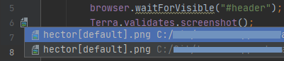
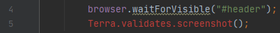
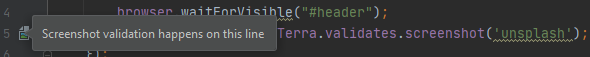

# Terra Screenshots

## Inspections

### Terra element validation is preferred over screenshot validation

This inspection reports problems where either a `Terra.validates.screenshot()` or a `Terra.it.matchesScreenshot()` call is used.

This is based on that some projects might want to/have to incorporate accessibility features and validation in their products. This helps to make sure accessibility issues are caught during automated testing.

**Example:**

```javascript
Terra.describeViewports('Test', ['large', 'huge'], () => {
    describe('A describe block', () => {
        it('an it block', () => {
            browser.url('/some/url');
            Terra.validates.screenshot(); //correct: Terra.validates.element();
        });
    });

    Terra.it.matchesScreenshot(); //correct: Terra.it.validatesElement();
});
```

| Implementation class | Introduced in |
|---|---|
| [`TerraElementValidationIsPreferredOverScreenshotInspection`](../src/main/java/com/picimako/terra/wdio/screenshot/inspection/TerraElementValidationIsPreferredOverScreenshotInspection.java) | v0.1.0 | 

### misMatchTolerance value is above a predefined threshold

Although, in some circumstances, specifying the `misMatchTolerance` property may be necessary, it is good practice having a
threshold as the maximum value allowed for this property, since, quoting the [Terra Webdriver.io Utility Developer's Guide](https://github.com/cerner/terra-toolkit-boneyard/blob/main/docs/Wdio_Utility.md)

> increasing this value will decrease test coverage.

The default threshold is 0.5, but it can be overridden via the inspection's Settings UI.

**Examples (according to the default threshold):**

```javascript
Terra.validates.element({ misMatchTolerance: 0.6 });
Terra.validates.element({ misMatchTolerance: 23 });
Terra.validates.element({ misMatchTolerance: 181 });
```

| Implementation class | Introduced in |
|---|---|
| [`ScreenshotMismatchToleranceInspection`](../src/main/java/com/picimako/terra/wdio/screenshot/inspection/ScreenshotMismatchToleranceInspection.java) | v0.1.0 |

### misMatchTolerance has negative value or a value greater than 100

According to the [Terra Webdriver.io Utility Developer's Guide](https://github.com/cerner/terra-toolkit-boneyard/blob/main/docs/Wdio_Utility.md)
the value specified in the `misMatchTolerance` property should be a number **between 0 and 100**, thus this inspection is meant to signal values
that are either negative or greater than 100.

**Examples:**

```javascript
Terra.validates.element({ misMatchTolerance: -4 });
Terra.validates.element({ misMatchTolerance: 153 });
```

| Implementation class | Introduced in |
|---|---|
| [`ScreenshotMismatchToleranceBlockingInspection`](../src/main/java/com/picimako/terra/wdio/screenshot/inspection/ScreenshotMismatchToleranceBlockingInspection.java) | v0.1.0 |

### misMatchTolerance has a non-numeric value defined

According to the [Terra Webdriver.io Utility Developer's Guide](https://github.com/cerner/terra-toolkit-boneyard/blob/main/docs/Wdio_Utility.md)
the value specified in the `misMatchTolerance` property should be a **number** between 0 and 100, thus this inspection is meant to signal values
that are not numeric ones.

**Examples:**

```javascript
Terra.validates.element({ misMatchTolerance: "asdsad" });
Terra.validates.element('test case', { selector: '#root', misMatchTolerance: "asdsad" });
Terra.validates.element('test case', { misMatchTolerance: { } });
Terra.validates.element('test case', { misMatchTolerance: false });
```

| Implementation class | Introduced in |
|---|---|
| [`ScreenshotMismatchToleranceBlockingInspection`](../src/main/java/com/picimako/terra/wdio/screenshot/inspection/ScreenshotMismatchToleranceBlockingInspection.java) | v0.1.0 |

### Missing screenshots

When an image, referenced by `Terra.it` and `Terra.validates` calls, doesn't exist for any context (locale, browser, viewport),
this inspection marks either the name parameter of such calls, or if they are missing (and the default value `default` is used),
then marks the function call's name element.

**Examples:**

In the following snippet the String literal `'screenshot'` will be marked

```js
Terra.describeViewports('viewports', ['medium'], () => {
    describe('terra', () => {
        Terra.it.validatesElement('screenshot', { selector: '#selector' });
    });
});
```

while in the next one, it is the `Terra.it.validatesElement` part that gets marked:

```js
Terra.describeViewports('viewports', ['medium'], () => {
    describe('terra', () => {
        Terra.it.validatesElement({ selector: '#selector' });
    });
});
```

| Implementation class | Introduced in |
|---|---|
| [`MissingScreenshotInspection`](../src/main/java/com/picimako/terra/wdio/screenshot/inspection/MissingScreenshotInspection.java) | v0.2.0 |

### Screenshot selector matches Terra global selector

Terra-toolkit provides various config options for wdio test execution that can be defined in the project's wdio.conf.js.
One of these properties is `terra.selector` in which a global/default CSS selector can be specified for capturing screenshots
when no CSS selector is specified explicitly in a test.

Given the following `wdio.conf.js`:

```js
const wdioConf = require('./config/wdio/wdio.conf');
const config = {
    ...wdioConf.config,
    terra: {
        selector: '#global-selector',
    },
};
exports.config = config;
```

during screenshot capturing the following selectors will be used:

```js
Terra.validates.element('an element', { selector: '#selector' }); // #selector

Terra.validates.element('an element'); // #global-selector
```

| Implementation class | Introduced in |
|---|---|
| [`GlobalTerraSelectorInspection`](../src/main/java/com/picimako/terra/wdio/screenshot/inspection/GlobalTerraSelectorInspection.java) | v0.2.0 |

## References

By invoking one of the "Go to declaration" shortcuts on the first, String parameter of screenshot validation function calls, you can navigate to the
`reference` version of the referenced image, or images when there are multiple ones with the same name but different contexts.

**Example:**

The code snippet below will reference the screenshot(s) named `terra_screenshot[with_extra_-_plus_info-].png`:

```js
describe('outer describe', () => {
    describe('terra screenshot', () => {
        Terra.it.matchesScreenshot('with extra | plus info?', { selector: '#selector' });
    });
});
```

while the snippet below will reference `terra_screenshot-[with_extra_--plus_info].png`:

```js
describe('terra screenshot?', () => {
    it ('test case', () => {
        Terra.validates.element('with extra <> plus info');
    });
});
```
Test IDs are also supported, so the following snippet will reference `terra_screenshot[test_id].png`:

```js
describe('terra screenshot', () => {
    it ('test case', () => {
        Terra.validates.element('partial [test id]');
    });
});
```

A set of characters are replaced, so that characters reserved by operating systems will not be used in file names:
- any whitespace, the dot (.) and + characters are replaced with an underscore (_)
- ?, <, >, /, |, *, :, " characters are replaced with a hyphen (-)
- also, the starting and ending whitespaces are trimmed separately both in the first part of the screenshot name, and in
the part between the \[ and \] characters. 

For the following calls, there will be no reference added, since there is no element (the name parameter) to add the reference to:

```js
Terra.validates.screenshot({ selector: '#root'});
Terra.validates.element({ selector: '#root' });
Terra.it.matchesScreenshot({ selector: '#root' });
Terra.it.validatesElement({ selector: '#root' });
```

| Implementation class | Introduced in |
|---|---|
| [`TerraScreenshotReferenceContributor`](../src/main/java/com/picimako/terra/wdio/screenshot/reference/TerraScreenshotReferenceContributor.java) | v0.2.0 |

## Quick Documentations

### Terra WDIO objects and functions

There are a few external documentations on GitHub that are useful for Terra wdio testing. Currently these are:
- [Webdriver.io Utility Developer's Guide](https://github.com/cerner/terra-toolkit-boneyard/blob/main/docs/Wdio_Utility.md)
- [Axe Accessibility Rule Descriptions](https://github.com/dequelabs/axe-core/blob/develop/doc/rule-descriptions.md)

To make them easily available, they are included in the Quick Documentation popup of each Terra object and function name that are related to wdio testing.


When there are multiple documentations e.g. for `validatesElement()` that include both screenshot validation and accessibility testing, multiple relevant links are displayed:


| Implementation class | Introduced in |
|---|---|
| [`TerraWdioDocumentationProvider`](../src/main/java/com/picimako/terra/documentation/TerraWdioDocumentationProvider.java) | v0.1.0 |

## Line markers / Gutter icons

To complement the logic provided by the Terra screenshot reference contributor, and to provide visual clues about where in a spec file
screenshot validations are actually present, there are line markers added for each Terra screenshot validation call.

Line markers are added for calls with or without a name parameter present, however references to the screenshots
are added only when the call references a "default" screenshot (with no name parameter). This way the screenshot
references added to those name parameters are complemented with this logic.

**Default screenshot**



**Missing default screenshot**

In case the call references a non-existent screenshot, the line marker is not added.



**Non-default screenshot**



| Implementation class | Introduced in |
|---|---|
| [`TerraScreenshotValidationLineMarkerProvider`](../src/main/java/com/picimako/terra/wdio/screenshot/gutter/TerraScreenshotValidationLineMarkerProvider.java) | v0.4.0 |
