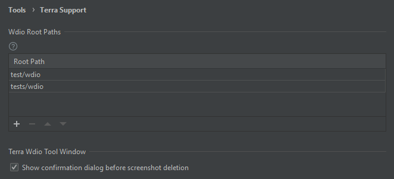

# Plugin Settings

Under `Settings > Tools > Terra Support` there are some configuration options to better customize the plugin's behaviour.

In the **Wdio Root Paths** table you can define the list of wdio root paths that the plugin will recognize. The Terra Wdio Tool Window
will use the first one it founds from this list, in the project.

As for the tool window, there is a confirmation dialog upon triggering the deletion of a screenshot. Whether to show it or not
can be controlled with the **Show confirmation dialog before screenshot deletion** checkbox.

Both option is applied on the IDE level, so they are applicable to all open projects.
