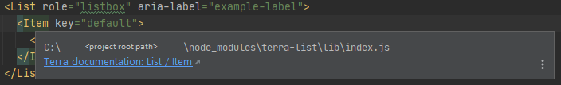

# Terra UI components

## Quick Documentations

 

In front-end applications, the [Terra UI Components](https://engineering.cerner.com/terra-ui/components) can be utilized as React JS tags (among other things).

Although regular external components have a default Quick Documentation popup with some basic information,
for Terra component tags it is extended with a link (right under the component path) pointing to the official documentation of the particular component, so it can
be opened right from the editor.

The generated documentation URLs are based on the Terra components' names (e.g. `ResponsiveElement`, or in case of subcomponents like `Grid.Row`, it is `Grid`), and the path from where they are imported.

Certain component names may be found in multiple Terra packages, in that case it is not just the component name that is shown in the link but the family / group name the component is imported from,
so that it can be distinguished from the component with the same name in other packages.

**Connection to other Quick Documentation popups**

If any of these Quick Documentation tooltips would interfere with, or override an existing functionality, that you need in a previous Quick Documentation popup content, please raise an issue.
