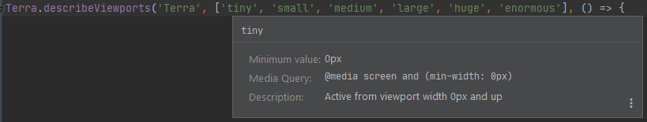

# Terra Viewports

## Inspections

### Incorrect viewport value(s) in Terra.describeViewports blocks

This inspection reports problems where one or more viewports defined in `Terra.describeViewports` are not one of the breakpoints supported by Terra, namely:
tiny, small, medium, large, huge, enormous.

Be it a completely different viewport name, or just a typo, such values would cause the test/test suite execution not to start.

**Examples:**

```javascript
Terra.describeViewports('', ['tiny', 'small', 'med', 'huge', 'enorm'], () => {
});

Terra.describeViewports('', ['gigantic'], () => {
});
```

| Implementation class | Introduced in |
|---|---|
| [`TerraDescribeViewportsBlockingInspection`](../src/main/java/com/picimako/terra/wdio/viewports/inspection/TerraDescribeViewportsBlockingInspection.java) | v0.1.0 |

### Viewports in Terra.describeViewports should be enumerated in ascending order

This inspection reports problems where the viewports in `Terra.describeViewports` are not specified in ascending order by their widths.

Although the order in what the viewports are specified doesn't affect the test execution negatively,
having them specified this way ensures that test implementations are consistent, and it is easily readable what viewports are actually covered.

**Examples:**

```javascript
Terra.describeViewports('', ['large', 'huge', 'medium'], () => {
    //correct: ['medium', 'large', 'huge']
});

Terra.describeViewports('', ['tiny', 'enormous', 'medium', 'large', 'huge', 'small'], () => {
    //correct: ['tiny', 'small', 'medium', 'large', 'huge', 'enormous']
});
```

| Implementation class | Introduced in |
|---|---|
| [`TerraDescribeViewportsInspection`](../src/main/java/com/picimako/terra/wdio/viewports/inspection/TerraDescribeViewportsInspection.java) | v0.1.0 |

### Duplicate viewport values in Terra.describeViewports blocks

Copy-paste issues and typos can happen, so this inspection checks for duplicate viewport values, but only highlights
the ones that are actually supported by terra. The rest will be signaled by another inspection, that they are not supported.

**Example:**

```javascript
Terra.describeViewports('', ['small', 'small'], () => {
});

Terra.describeViewports('', ['asd', 'enormous', 'asd', 'enormous', 'huge', 'enormous'], () => {
});
```

Having duplicate viewports is not an incorrect construct, and in itself it doesn't result in test execution failure.
To the contrary, it may be used to run test cases multiple times for the same viewport(s). But that is most probably not something you would want to
make a permanent part of the test implementation.

In the example above, the first `Terra.describeViewports` block would execute the selected test cases for the *small* viewport twice.

| Implementation class | Introduced in |
|---|---|
| [`TerraDescribeViewportsInspection`](../src/main/java/com/picimako/terra/wdio/viewports/inspection/TerraDescribeViewportsInspection.java) | v0.1.0 |

### Blank viewports argument array in Terra.describeViewports blocks

This inspection reports problems where either the viewports argument is an empty array, or all items in it are blank
(either empty or contain only whitespaces).

**Example:**

```javascript
Terra.describeViewports('', [], () => {
});

Terra.describeViewports('', [''], () => {
});

Terra.describeViewports('', ['', '  ', ''], () => {
});
```

| Implementation class | Introduced in |
|---|---|
| [`TerraDescribeViewportsBlockingInspection`](../src/main/java/com/picimako/terra/wdio/viewports/inspection/TerraDescribeViewportsBlockingInspection.java) | v0.1.0 |

### Non-array-type viewports argument value in Terra.describeViewports blocks

The viewports argument of `Terra.describeViewports` accepts an array only, so any other type of value will be reported by this check.

In v0.5.0 it is also extended to handle `const` variable references initialized as arrays. `var` and `let` type variables, as well as
function calls are ignored. This is so that the code doesn't need to add unnecessary complexity to try to find out the actual type of a variable
among the uncertain number of value assignments they may have.

**Example:**

```javascript
Terra.describeViewports('', { }, () => {
});

Terra.describeViewports('', 'tiny', () => {
});

Terra.describeViewports('', false, () => {
});

const VIEWPORTS = ['tiny','small'];
Terra.describeViewports('', VIEWPORTS, () => {
});
```

| Implementation class | Introduced in |
|---|---|
| [`TerraDescribeViewportsBlockingInspection`](../src/main/java/com/picimako/terra/wdio/viewports/inspection/TerraDescribeViewportsBlockingInspection.java) | v0.1.0 |

### Nested Terra.describeViewports blocks

This inspection is based on the official [Terra Webdriver.io Utility Developer's Guide](https://github.com/cerner/terra-toolkit-boneyard/blob/main/docs/Wdio_Utility.md)
which states that
> Terra.describeViewports blocks should not be nested and if tests need to run against different viewports then they should have their own top level Terra.describeViewports block.

Thus, the nested `Terra.describeViewports` blocks, such as the ones in the example below, should be avoided and replace with top level ones:

```javascript
Terra.describeViewports('Top level', ['tiny', 'small'], () => {
    describe('A describe block', () => {
        Terra.describeViewports('More nested', ['medium', 'enormous'], () => {
        });
        it('an it block', () => {
        });
    });
});

Terra.describeViewports('Top level', ['tiny', 'large'], () => {
    Terra.describeViewports('Nested', ['huge', 'large'], () => {
    });
});
```

| Implementation class | Introduced in |
|---|---|
| [`NestedTerraDescribeViewportsBlocksNotAllowedInspection`](../src/main/java/com/picimako/terra/wdio/viewports/inspection/NestedTerraDescribeViewportsBlocksNotAllowedInspection.java) | v0.1.0 |

### Duplicate Terra.describeViewports blocks

Since tests are organized into different blocks (`Terra.describeViewports`, `describe`, `it`, etc.) it may happen that within the same file there are multiple `Terra.describeViewports`
that are specified with the same set of viewport values. In this case it is probable that those blocks can be merged and all their test cases be handled under the same single
`describeViewports` block.

Neither the name parameter of the `describeViewports` block, nor the order of the viewport values are taken into account, so in the below example the first and the last blocks will be reported.

```javascript
Terra.describeViewports('Test', ['tiny', 'small'], () => { // This is reported.
});

Terra.describeViewports('Test', ['tiny','small','huge'], () => {
});

Terra.describeViewports('Another Test', ['small','tiny',], () => { // This is also reported.
});
```

| Implementation class | Introduced in |
|---|---|
| [`DuplicateDescribeViewportsBlockInspection`](../src/main/java/com/picimako/terra/wdio/viewports/inspection/DuplicateDescribeViewportsBlockInspection.java) | v0.4.0 |

## Quick Documentations

Each viewport String value (only the supported viewports) within `Terra.describeViewports` argument list is extended with Quick Documentation, providing
basic information about the desired viewport.



The information shown is based on the Breakpoints table in the [Terra Breakpoints Guide](https://engineering.cerner.com/terra-ui/components/terra-breakpoints/breakpoints/about#breakpoints).

| Implementation class | Introduced in |
|---|---|
| [`TerraDescribeViewportsDocumentationProvider`](src/main/java/com/picimako/terra/documentation/TerraDescribeViewportsDocumentationProvider.java) | v0.1.0 |
