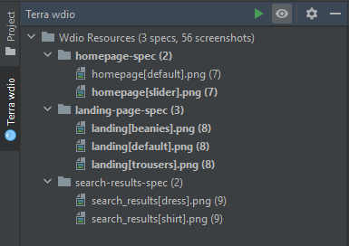
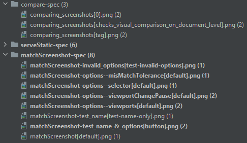
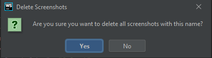
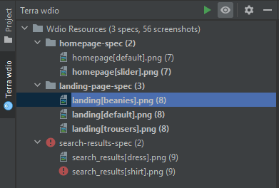

# Terra wdio tool window

This is a custom tool window which is inspired by the [Terra Wdio Helper VSCode plugin](https://marketplace.visualstudio.com/items?itemName=juzerzarif.terra-wdio-helper),
which is a great plugin, so if you are working with VSCode and Terra testing, make sure you have it installed. It will greatly benefit you.

This tool window collects the wdio spec files and screenshots in the project, and provides a more convenient aggregate view of them,
with additional actions for bulk operations to be applied on those files and folders.

**NOTE**: currently it doesn't support when multiple projects are opened in the same application window in the same workspace.

| Implementation package | Introduced in |
|---|---|
| [`com.picimako.terra.wdio.toolwindow`](../src/main/java/com/picimako/terra/wdio/toolwindow) | v0.1.0 |
| [`FindUnusedScreenshotsAction`](../src/main/java/com/picimako/terra/wdio/toolwindow/FindUnusedScreenshotsAction.java) | v0.3.0 |

## Aggregate view

The tool window provides a tree view of the wdio resources in the project, which maps the original folder structure of Terra wdio files,
like this (having `tests/wdio` as the base folder):

```
- tests
    - wdio
        - __snapshots__
             - diff
                 - <locale>
                     - <browser>_<viewport>
                         - <spec file name>
                             - <screenshot_1>.png
                         - <another spec file name>
                             - <screenshot_3>.png
             - latest
                 - <locale>
                     - <browser>_<viewport>
                         - <spec file name>
                             - <screenshot_1>.png
             - reference
                 - <locale>
                     - <browser>_<viewport>
                         - <spec file name>
                             - <screenshot_1>.png
                             - <screenshot_2>.png
                             - ...
             - reports
                 - <result-report-name>.json
             - <spec-file-name>-spec.js
             - <another-spec-file-name>-spec.js
             - <nestedfolder>
                - <nested>-spec.js
                - __snapshots__
                    - <screenshot folder structure>
```

and creates a new structure, so that users can have an overview of what specs and screenshots are available in the project, and can handle multiple specs and screenshots with a single command,
as bulk operations:

```
- Wdio Resources                  <- This is the root node in the tree, which is permanent. It cannot be modified or removed.
     - <spec file name>           <- A spec node referencing all spec folders with the same name.
         - <screenshot_1>.png     <- A screenshot node referencing all screenshot files with the same name.
         - <screenshot_2>.png
     - <another spec file name>
         - <screenshot_3>.png
     - <nestedfolder>/<nested>-spec
         - <screenshots>
```

When building this tree view, the logic behind also takes into account when spec JS files are in single or multiple subfolders under the base test path.
They are collected in the same way into this view, their parent folders (as of now) are not displayed in the tool window.



## Wdio test root paths

Since wdio test resources can be placed anywhere in a project, the tool window currently supports the probably most common wdio root paths:
- `/tests/wdio`
- `/test/wdio`

If any of these are found, the tool window will base the resource collection and aggregate view building on that particular test root folder.

The set of wdio test roots are stored at `com.picimako.terra.wdio.TerraWdioFolders#BASE_TEST_ROOTS`.

For now, if a project happen to use a different root than the currently supported ones, there are two ways to support it.
Either rename that folder to one of the pre-defined ones, or add that folder to the set of roots, which also requires a new build and release of this plugin,
but the first is the preferred option.

## Criteria for the tool window to be enabled

Since only certain projects require the Terra wdio tool window, specifically the ones that has wdio tests, the tool window has the following criteria,
which when met, the tool window is displayed:
- the project is not a default project
- one of the wdio test root folders is present in the project

## Node types

There are three node types in the tool window
- the **Wdio Resources** root node which is permanent, cannot be moved, removed or modified, it is there, so that the tree view has a root,
  and that it provides statistics about the overall project from wdio perspective.
- **Spec node**: for each spec JS file in the project, it displays a folder node for the spec folders with the same name.
  Under the hood, it stores the references for each spec folder in the project for the name, from each `__snapshots__/reference` folders.
- **Screenshot node**: screenshots are displayed within the spec folders. For each screenshot file name in the project, it displays a screenshot node.
  Under the hood it keeps track of screenshots of the same name from each `__snapshots__/diff`, `__snapshots__/latest` and `__snapshots__/reference` folders,
  regardless of what locale and browser_viewport folders they are in.
  
  It might happen that a screenshot node is display with a 0 statistics count. That can happen when there is no reference image for that name (the 0 count)
  but there is at least one diff and/or latest screenshot for it.

### Highlighting nodes

Screenshot nodes are highlighted with bold text when at least one of the underlying image files for a name has a diff image. This makes it easier to see
what images' comparisons failed.

Spec nodes are also highlighted with bold text when at least one of the underlying image nodes has a diff image.



## Statistics

All three node types provide basic statistics about the number of specs and screenshots available in the project.
- **Wdio Resources**: displays statistics about the overall, distinct number of spec JS files and screenshot files in the project.
- **Spec node**: displays how many screenshots can be found under the spec with a distinct name
- **Screenshot node**: displays the number of screenshot files that are available with this particular node's name

## Actions

Screenshot nodes also provide bulk actions to work with them, in the form of context menu items and keyboard shortcuts.


| Action | Description | Shortcut keys |
|---|---|---|
| Rename Screenshots | Renames all screenshot files under the wdio test root with the same name.<br>When this action is invoked, a message popup appears populated with the file name, for which a simple validation is in place: the new name cannot be blank, and cannot be the same as its original name.<br>If the extension is erased from the new name, it is added back automatically before saving. | **Shift+F6** (the common Rename shortcut) |
|  |  |  |
| Delete Screenshots | Deletes all screenshot files under the wdio test root with the same name.<br>Before deletion, it show a message popup asking for confirmation from the user whether he/she really wants to delete all such files. | **Delete** |
|  |  |  |
| Replace Reference With Latest | Replaces all reference screenshot files with their latest counterparts under the wdio test root with the same name.<br>The action is available only when there is at least one screenshot as the latest version of the reference images. | **Ctrl+R** (**Command+R** on Mac) |
| Navigate to Usage | Navigates to the code section (the Terra validation call) where the selected screenshot is referenced. | **Ctrl+B** (**Command+B** on Mac) |
|  | If there is no spec file (it has been deleted after or wasn't available at the IDE startup), but the screenshots linked screenshots are still available in the __snapshots__ directory, the dialog below is shown:<br> |  |
|  | If there is no validation linked to this image (the Terra validation call was removed entirely or it references this image by a different name), the following dialog is shown:<br> |  |
| Show Diffs | Opens the Terra Diff Preview for the selected image name.<br>The action is available only when there is at least one screenshot as the diff version of the reference images.<br><br>See details in the [Diff screenshot previews](#diff-screenshot-previews) section below.|  **Ctrl+D** (**Command+D** on Mac) |
| Compare Latests With References | Opens the Terra Diff Preview for the selected image name.<br>The action is available only when there is at least one screenshot as the latest version of the reference images.<br><br>See details in the [Diff screenshot previews](#diff-screenshot-previews) section below. | **Enter** shortcut key or **mouse double-click** |

## Diff screenshot previews

There are two image previews available for viewing diff screenshots. These are custom editor implementations for displaying one or more screenshots in the same view,
so that investigating a diff screenshot collection for the same file name (but for different contexts) becomes easier.

These previews are displayed as separate editor tabs when an image file is opened, and that particular image file is eligible for showing the preview.

|  | Terra: Diff Preview | Terra: Reference / Latest Preview |
|---|---|---|
| From where can it be opened? | From the **Project view**, or from the **Terra wdio tool window**, selecting the `Show Diffs` context menu option on a screenshot node. | From the **Project view**, or from the **Terra wdio tool window**, selecting the `Compare Latests With References` context menu option on a screenshot node. |
| Which files does it open for? | From the **Project view**, it is displayed when opening any Terra `diff` image. From the **Terra wdio tool window** it can be opened for screenshot nodes but only if there is at least one `diff` screenshot for that file name. | From the **Project view**, it is displayed when opening any Terra `reference` or `latest` image. From the **Terra wdio tool window** it can be opened for screenshot nodes but only if there is at least one `latest` screenshot for that file name. |
| Does it get focus? | When an image is opened via the **Project view**, the default image editor is shown. Using the `Show Diffs` context menu option also focuses the view on the Diff Preview.  | Behaves the same as for the `Diff Preview` but instead it is the `Reference / Latest Preview` that is focused. |
| What is displayed in the preview? | It shows one or more `diff` images for a given screenshot name. | It shows one or more pairs of `reference`/`latest` images, each displayed side-by-side. Each split panel can be resized but their states are not remembered for later openings. |

Both previews also show the screenshot context (locale, browser, viewport) above each image to help identify them.

**Terra: Diff Preview**


**Terra: Reference/Latest Preview**


## Analyzing project for unused screenshots

During the lifetime of a project it may happen that test implementations are changed or cleaned up but related screenshots are forgot
to be updated or removed.

In the header section of the tool window you can find an **Analyze** action (green play icon) which analyzes the current project and
marks screenshots that are not referenced by any terra wdio test implementation.  This is an on-demand action run only when a user triggers it manually.

Marking nodes means a red exclamation mark icon put in front of screenshot nodes and their containing spec nodes as well to signal that
there is at least one unused screenshot within those particular specs.



**NOTES**:
- Project analysis for unused screenshots will not happen automatically in future releases either, so the plugin code is kept simpler,
so it will require less resources due to the lack of constant project analysis.
- This feature is available only in IntelliJ build 202.5103.13 and later.
